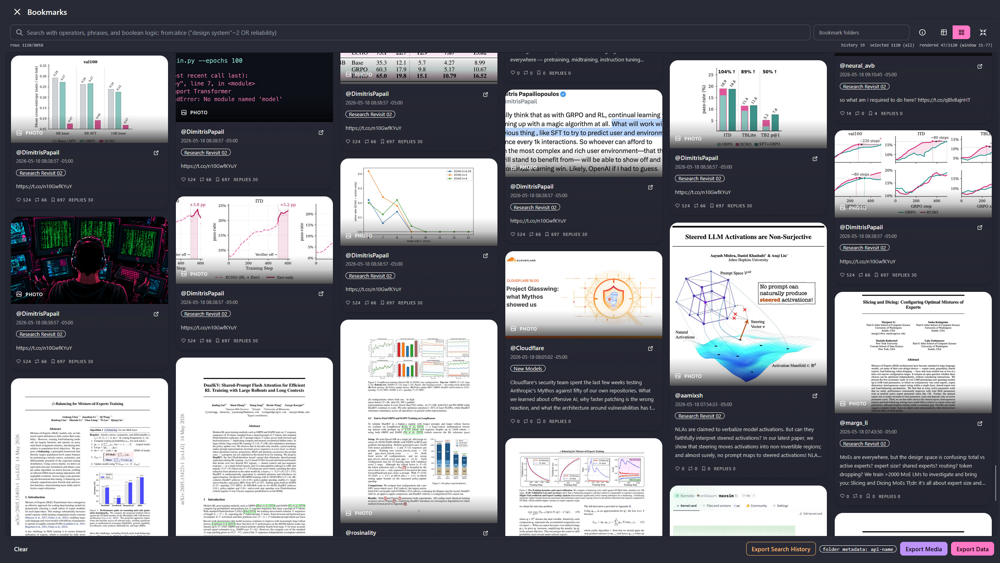
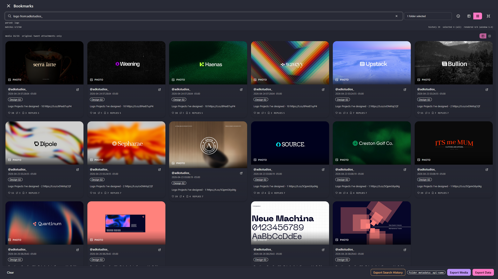
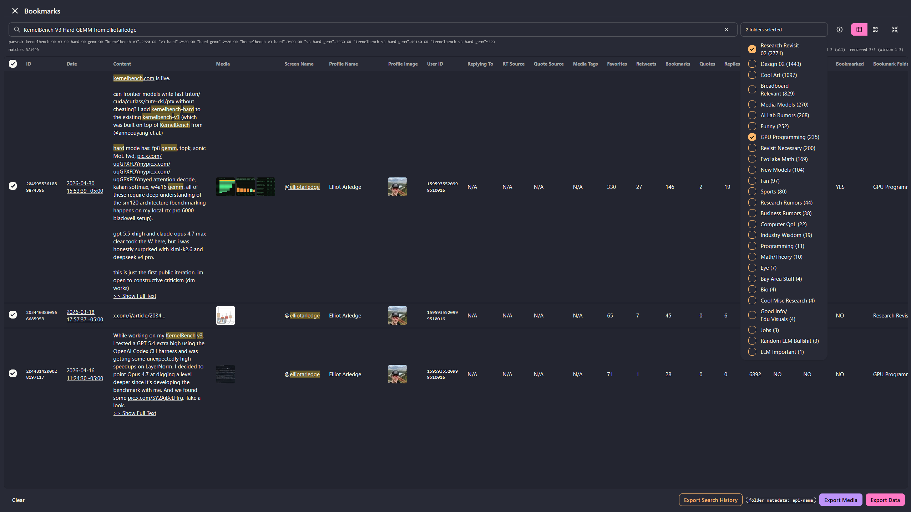
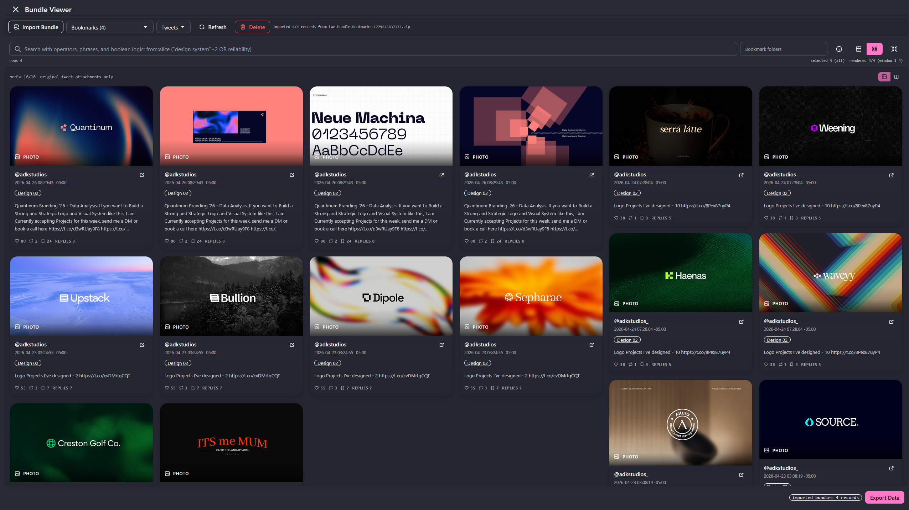
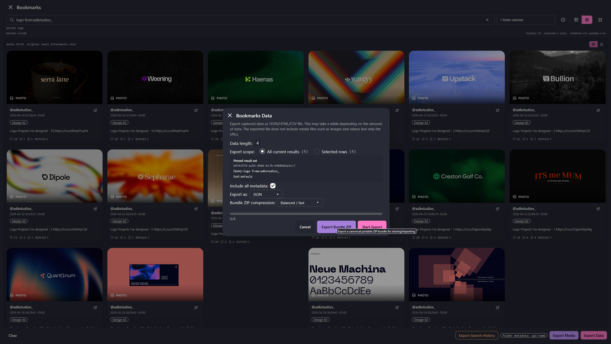
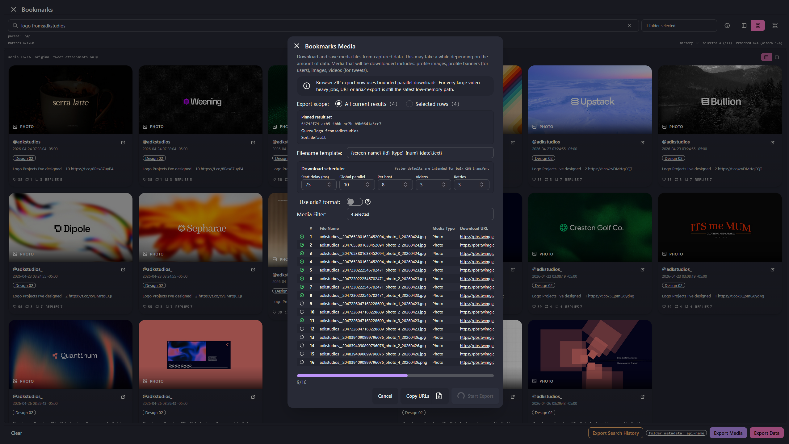
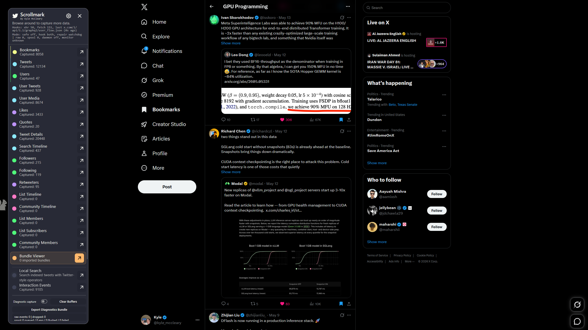
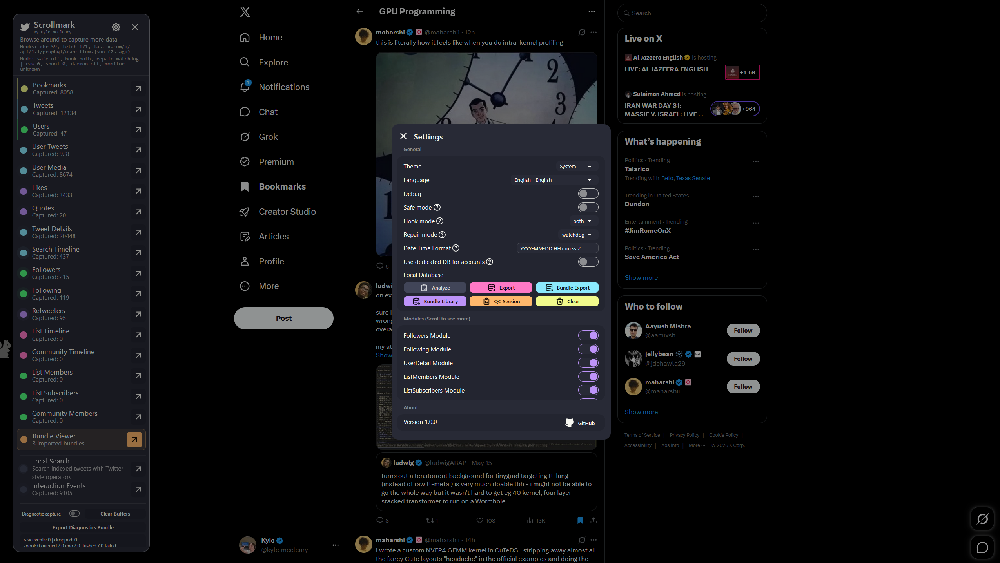
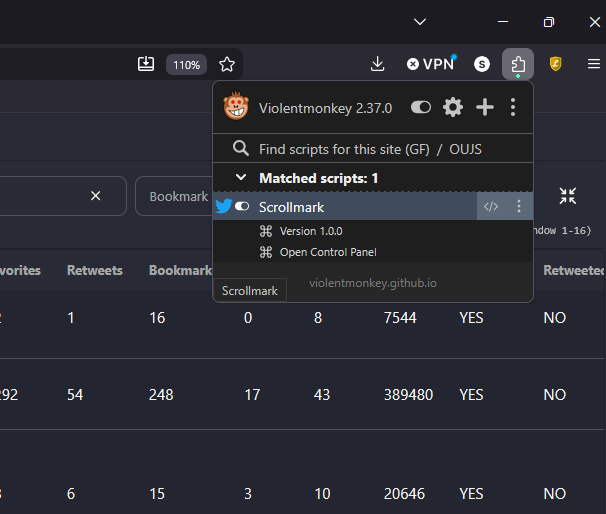

<div align="center">
  

  <h1>Scrollmark</h1>

  <p>
    <strong>Local-first X/Twitter research archive, search workbench, media viewer, and portable bundle system.</strong>
  </p>

  <p>
    Built for researchers, designers, engineers, and high-signal collectors who need to preserve, search, inspect, and share what flows through the X web app without sending private archives to a cloud service.
  </p>

  <p>
    <a href="https://github.com/kmccleary3301/scrollmark/releases/latest"></a>
    <a href="https://github.com/kmccleary3301/scrollmark/actions/workflows/ci.yml"></a>
    <a href="LICENSE"></a>
    <a href="https://github.com/kmccleary3301/scrollmark/releases/latest/download/scrollmark.user.js"></a>
    
    
    
    
  </p>

  <p>
    <a href="https://github.com/kmccleary3301/scrollmark/issues">Issues</a>
    ·
    <a href="docs/README.zh-Hans.md">简体中文</a>
    ·
    <a href="docs/bundles/canonical-bundle-v1.md">Bundle Format</a>
    ·
    <a href="docs/release/unified-qc-session-runbook.md">QC Runbook</a>
    ·
    <a href="docs/release/final-hill-performance-gates.md">Performance Gates</a>
    ·
    <a href="docs/release/store-listing-draft.md">Store Listing Draft</a>
    ·
    <a href="docs/release/publishing-runbook.md">Publishing Runbook</a>
    ·
    <a href="store/scrollmark.user.js">Store Sync Artifact</a>
  </p>
</div>

> Scrollmark is maintained by Kyle McCleary. It began as an MIT-licensed fork of [`prinsss/twitter-web-exporter`](https://github.com/prinsss/twitter-web-exporter), but has since been rebuilt and overhauled across capture, search, storage, UI, bundle import/export, diagnostics, performance, branding, and release workflows. Original copyright and license notices are preserved.

## Contents

- [What Scrollmark does](#what-scrollmark-does)
- [Screenshots](#screenshots)
- [Feature matrix](#feature-matrix)
- [Installation](#installation)
- [Core workflow](#core-workflow)
- [Search language](#search-language)
- [Portable bundles](#portable-bundles)
- [Exports](#exports)
- [Privacy and security model](#privacy-and-security-model)
- [Performance model](#performance-model)
- [Project map](#project-map)
- [Development](#development)
- [Testing and release gates](#testing-and-release-gates)
- [Limitations](#limitations)
- [FAQ](#faq)
- [Roadmap](#roadmap)
- [Attribution and license](#attribution-and-license)

## What Scrollmark does

Scrollmark runs as a userscript on `x.com`, `twitter.com`, and `mobile.x.com`. It observes the same GraphQL/API responses that the X web app loads while you browse, parses useful structures out of those responses, stores them locally in IndexedDB, and gives you a fast explorer for search, review, export, and sharing.

It is intentionally not a cloud product, not a bot, and not a Twitter/X developer API client. The core idea is simple: if the web app loads useful research material into your browser, Scrollmark can help you preserve and query it locally.

| Area          | What it gives you                                                                                                                                                                      | Why it matters                                                                                           |
| ------------- | -------------------------------------------------------------------------------------------------------------------------------------------------------------------------------------- | -------------------------------------------------------------------------------------------------------- |
| Local capture | Bookmarks, tweets, likes, users, media, followers/following surfaces, retweeters, quotes, search timelines, lists, communities, and runtime diagnostics.                               | Build an archive naturally while browsing instead of manually copy-pasting threads, media, and metadata. |
| Search        | Natural text search, exact phrases, phrase slop, boosts, boolean logic, exclusions, author shorthand, folders, dates, numeric filters, URLs/domains, and raw dotted-field constraints. | Treat a large bookmark corpus more like a research index than a flat export file.                        |
| Exploration   | Fullscreen virtualized table view plus a tailored masonry media view with deterministic paging.                                                                                        | Scan thousands of records without loading the entire archive into the DOM.                               |
| Sharing       | Canonical ZIP bundle export/import for portable, isolated research collections.                                                                                                        | Send a curated archive to a collaborator without giving them your account, cookies, or live X state.     |
| Diagnostics   | Raw capture, debug counters, search history export, performance probes, and diagnostic bundles.                                                                                        | Reproduce parser, capture, and browser-runtime issues with concrete evidence.                            |

## Screenshots

<table>
  <tr>
    <td width="42%">
      <strong>Visual research archive</strong><br><br>
      Switch the bookmark explorer into fullscreen masonry mode to scan papers, diagrams, design references, screenshots, article cards, and videos as a spatial archive.
      <br><br>
      The masonry view keeps deterministic ordering and folder-aware filtering, so it behaves like an infinite visual feed rather than a static export preview.
    </td>
    <td width="58%">
      
    </td>
  </tr>
  <tr>
    <td width="58%">
      
    </td>
    <td width="42%">
      <strong>Table search and inspection</strong><br><br>
      Use the table view for dense metadata work: exact snippets, author operators, folders, metrics, dates, media cells, selected-row export, and raw IDs stay visible in one place.
      <br><br>
      The search bar supports natural language, exact phrases, boosted phrase windows, boolean logic, exclusions, author shorthand, folders, dates, domains, and dotted metadata fields.
    </td>
  </tr>
  <tr>
    <td width="42%">
      <strong>Portable Bundle Viewer</strong><br><br>
      Imported bundles reuse the same explorer spine as live bookmarks instead of falling back to a raw JSON scroller.
      <br><br>
      A collaborator can open a shared archive, search it, filter it, inspect it in masonry mode, and export derived subsets without touching their own live X account data.
    </td>
    <td width="58%">
      
    </td>
  </tr>
  <tr>
    <td width="58%">
      
    </td>
    <td width="42%">
      <strong>Data and bundle export</strong><br><br>
      Export selected rows, all current results, or a canonical bundle ZIP for sharing. Bundle export is separate from raw JSON/CSV/HTML export so portable archives can carry manifest metadata and normalized record files.
      <br><br>
      Search history export is available when ranking, phrase matching, or repro-quality diagnostics matter.
    </td>
  </tr>
  <tr>
    <td width="42%">
      <strong>Fast media export</strong><br><br>
      Download image and video attachments in bulk, tune concurrency and pacing, include metadata sidecars, or copy URL manifests for external tooling.
      <br><br>
      Media export is intentionally separate from canonical bundle export: bundle ZIPs are for portable data archives; media export is for large binary downloads.
    </td>
    <td width="58%">
      
    </td>
  </tr>
  <tr>
    <td width="58%">
      
    </td>
    <td width="42%">
      <strong>Live capture widget</strong><br><br>
      The floating widget tracks module counters while you browse, exposes monitors and Bundle Viewer, and keeps diagnostic controls close without forcing a separate backend or dashboard.
      <br><br>
      Scrollmark observes the same browser-loaded GraphQL/API responses the X web app is already using.
    </td>
  </tr>
  <tr>
    <td width="42%">
      <strong>Settings and localization</strong><br><br>
      Configure hook mode, safe mode, repair mode, module monitors, database actions, bundle library, language, theme, and diagnostics from the in-page settings panel.
      <br><br>
      The UI has a localization layer rather than hard-coded English-only strings.
    </td>
    <td width="58%">
      
    </td>
  </tr>
</table>

## Feature matrix

| Capability                           |               Status | Notes                                                                                               |
| ------------------------------------ | -------------------: | --------------------------------------------------------------------------------------------------- |
| Bookmark capture and folder metadata |            🟢 Stable | Captures bookmark timelines and folder views as the X web app loads them.                           |
| Tweet/user indexing                  |            🟢 Stable | Normalized tweet and user records are materialized for table, masonry, and search.                  |
| Article-post support                 |            🟢 Stable | Article-style X posts are parsed into searchable/exportable records where the web app exposes them. |
| Local search                         |            🟢 Stable | Worker-backed search path for large corpora; exact phrases and phrase windows are boosted.          |
| Table explorer                       |            🟢 Stable | Virtualized rendering, paged IndexedDB hydration, selected-row export, fullscreen mode.             |
| Masonry media explorer               |            🟢 Stable | Designer-oriented media scan with deterministic ordering and folder-aware refresh.                  |
| Canonical bundle export/import       |            🟢 Stable | ZIP bundles import into isolated bundle-library tables and do not mutate live captures.             |
| JSON/CSV/HTML data export            |            🟢 Stable | Classic exports remain available for selected rows or result sets.                                  |
| Bulk media export                    | 🟡 Browser-dependent | Large binary exports are constrained by browser memory and download behavior.                       |
| Diagnostics and raw capture          |            🟢 Stable | Designed for parser repair, regression investigation, and performance QC.                           |
| Full automation                      |        🔴 Not a goal | Scrollmark observes normal browsing; it is not an autonomous scraping bot.                          |

## Installation

### Release install

1. Install a userscript manager.
   - Firefox: [Violentmonkey](https://violentmonkey.github.io/) or [Tampermonkey](https://www.tampermonkey.net/).
   - Chrome: [Tampermonkey](https://www.tampermonkey.net/) with browser user scripts enabled.
2. Install the latest Scrollmark userscript:

```text
https://github.com/kmccleary3301/scrollmark/releases/latest/download/scrollmark.user.js
```

3. Open or hard-reload `https://x.com/home`.
4. Confirm the floating Scrollmark launcher appears on the page.
5. Open the widget and verify the header reads:

```text
Scrollmark
By Kyle McCleary
```

<p align="center">
  
</p>

### Chrome note

Recent Chrome builds require explicit user-script permission for userscript managers.

| Step | Where                  | What to verify                                                                                |
| ---- | ---------------------- | --------------------------------------------------------------------------------------------- |
| 1    | `chrome://extensions`  | Developer mode can stay off; this is not an unpacked extension install.                       |
| 2    | Tampermonkey details   | Enable `Allow user scripts` if Chrome exposes that toggle.                                    |
| 3    | Tampermonkey dashboard | Confirm `Scrollmark` is enabled and matches `x.com/*`, `twitter.com/*`, and `mobile.x.com/*`. |
| 4    | X tab                  | Hard reload after install or reinstall.                                                       |

### Local development install

The production build emits `dist/scrollmark.user.js`.

```bash
npm install
npm run build
```

For the local e2e install endpoint used during development, serve the parent workspace so the historical compatibility path resolves:

```bash
cd /home/skra/projects/twitter_scraping
python3 -m http.server 8123
```

Then install the generated e2e build from the compatibility URL used by `vite.config.ts`:

```text
http://localhost:8123/greasemonkey_project/twitter-web-exporter/dist/twitter-web-exporter-e2e.user.js
```

## Core workflow

1. Browse X normally.
   - Open home timeline, bookmarks, bookmark folders, user profiles, tweet threads, likes, followers/following pages, retweet panels, quote surfaces, lists, communities, or search timelines.
   - Scroll enough for the X web app to load the data you want preserved.
2. Watch the Scrollmark widget counters.
   - Counters represent parsed local captures, not all possible remote records.
   - If a page has not loaded a response in your browser, Scrollmark cannot parse it yet.
3. Open a module explorer.
   - `Bookmarks` is the primary research surface.
   - `Tweet Details`, `User Tweets`, `Likes`, `User Details`, and relationship modules expose other parsed shapes.
   - `Bundle Viewer` opens imported portable archives rather than live captures.
4. Search and filter.
   - Use plain text for broad recall.
   - Quote phrases for exact constraints.
   - Add operators for folders, authors, dates, media, domains, and numeric thresholds.
5. Choose a view.
   - Table view is best for metadata inspection, selection, and exports.
   - Masonry view is best for visual scanning of images/videos from tweets and article previews.
6. Export what you need.
   - `Export Data` for JSON/CSV/HTML or canonical bundle ZIP.
   - `Export Media` for large binary media downloads.
   - `Export Search History` when debugging search quality or ranking behavior.
7. Share safely.
   - Export a canonical bundle ZIP and send it to a collaborator.
   - The recipient imports it into the Bundle Library, where it remains isolated from their live X account data.

## Search language

Scrollmark search is intentionally closer to a compact research query language than a plain browser find box. Unstructured text is expanded into content-term matches plus boosted adjacent phrase windows; quoted phrases are enforced as phrases; operators add hard constraints.

### Quick examples

| Query                                               | Intent                                                     |
| --------------------------------------------------- | ---------------------------------------------------------- |
| `distributed systems design`                        | Broad natural-language search with phrase-window boosting. |
| `"full writeup on how"`                             | Require the exact phrase.                                  |
| `@sama agent systems`                               | Require author `sama`, then rank matching text.            |
| `from:alice ("design system"~2 OR reliability)`     | Author filter plus boolean phrase/text logic.              |
| `folder:"Design 02" has:media`                      | Restrict to a bookmark folder and media-bearing records.   |
| `domain:github.com min_likes:50`                    | Find GitHub-linked tweets with at least 50 likes.          |
| `since:2026-03-01 until:2026-03-31 -filter:replies` | Date-bounded search excluding replies.                     |
| `legacy.entities.hashtags.text:ai`                  | Raw dotted-path search over nested metadata.               |

### Operator families

| Family                | Syntax                                                                   | Examples                                          |
| --------------------- | ------------------------------------------------------------------------ | ------------------------------------------------- |
| Lexical               | free text, quotes, slop, boosts                                          | `agent memory`, `"design system"~2`, `machine^2`  |
| Boolean               | `AND`, `OR`, `NOT`, parentheses                                          | `(memory OR retrieval) AND evaluation`            |
| Identity              | `from:`, `from_id:`, `author_id:`, `@user`                               | `@openai`, `from_id:12345`                        |
| Reply/entity IDs      | `to:`, `to_id:`, `id:`, `conversation_id:`                               | `to:alice`, `id:1999`                             |
| Folder metadata       | `folder:`, `bookmark_folder:`                                            | `folder:"Research Revisit 02"`                    |
| Route/source metadata | `lang:`, `route:`, `source:`, `card_name:`                               | `lang:en`, `route:bookmarks`                      |
| URL metadata          | `domain:`, `url:`                                                        | `domain:arxiv.org`, `url:openai.com`              |
| Presence              | `is:`, `has:`                                                            | `is:reply`, `has:media`, `has:links`              |
| Compatibility         | `filter:`, `include:`                                                    | `filter:media`, `include:nativeretweets`          |
| Numeric thresholds    | `min_likes:`, `min_retweets:`, `min_replies:`, `min_bookmarks:`          | `min_bookmarks:10`                                |
| Time boundaries       | `since:`, `until:`, `since_time:`, `until_time:`, `since_id:`, `max_id:` | `since:2026-03-01`                                |
| Shorthands            | `mention:`, `#tag`, `$symbol`                                            | `mention:alice`, `#ai`, `$tsla`                   |
| Raw fields            | `field:value`, `field:"quoted phrase"`                                   | `core.user_results.result.legacy.name:"Jane Doe"` |

### Ranking notes

- Empty search defaults to newest-first ordering, preferably bookmark/save time where available and post time as fallback.
- Plain multi-term searches rank term hits and boosted adjacent phrase windows.
- Quoted phrases are strict phrase constraints.
- Folder filters and other metadata operators constrain the candidate set before display.
- Stale worker responses are ignored so slower older searches do not overwrite newer results.

## Portable bundles

Canonical bundles are ZIP files for sharing Scrollmark records without mutating anyone's account.

```text
bundle.zip
├─ manifest.json
├─ records/
│  └─ records.jsonl
└─ media/
   └─ media-urls.txt
```

| File                    | Purpose                                                                         |
| ----------------------- | ------------------------------------------------------------------------------- |
| `manifest.json`         | Bundle identity, producer metadata, privacy summary, counts, and file manifest. |
| `records/records.jsonl` | One validated bundle-record envelope per line.                                  |
| `media/media-urls.txt`  | Optional newline-delimited original media URLs for external download tools.     |

Imported bundles are stored in isolated IndexedDB tables:

```text
imported_bundles
imported_bundle_collections
imported_bundle_items
imported_entity_snapshots
imported_bundle_import_reports
```

That isolation is deliberate. Importing a bundle does not create X bookmarks, follow users, like posts, write to live tweet tables, or modify the recipient's account state. See [`docs/bundles/canonical-bundle-v1.md`](docs/bundles/canonical-bundle-v1.md) for the v1 format boundary.

## Exports

| Export path          | Best for                                                    | Output  |
| -------------------- | ----------------------------------------------------------- | ------- |
| JSON                 | Full-fidelity local analysis and scripting.                 | `.json` |
| CSV                  | Spreadsheet inspection and lightweight tabular processing.  | `.csv`  |
| HTML                 | Human-readable offline review.                              | `.html` |
| Canonical bundle ZIP | Sharing a searchable archive with another Scrollmark user.  | `.zip`  |
| Media ZIP            | Bulk binary media download.                                 | `.zip`  |
| Media URL list       | External download managers or reproducible media pipelines. | `.txt`  |
| Diagnostics bundle   | Bug reports, parser repair, performance investigation.      | `.zip`  |
| Search history       | Search-quality debugging and ranking regression analysis.   | `.json` |

For very large binary media exports, browser memory limits still matter. Canonical data bundles are designed to be much lighter than media ZIPs because they primarily contain structured records and optional media URLs rather than the media bytes themselves.

## Privacy and security model

Scrollmark is designed around local control.

| Principle           | Implementation                                                                            |
| ------------------- | ----------------------------------------------------------------------------------------- |
| Local-first storage | Captured records are stored in browser IndexedDB.                                         |
| No hosted backend   | There is no Scrollmark cloud service.                                                     |
| No X developer app  | The script observes the web app instead of using official API credentials.                |
| Explicit exports    | Data leaves your machine only when you export and share files yourself.                   |
| Isolated imports    | Bundle Library imports are separate from live capture tables.                             |
| Safe text rendering | Imported/captured text is escaped; sanitized `http`/`https` entity links are regenerated. |
| ZIP hardening       | Bundle import rejects absolute/parent traversal paths and enforces decompression limits.  |

Userscript permissions are intentionally narrow for this architecture:

```text
@match    *://twitter.com/*
@match    *://x.com/*
@match    *://mobile.x.com/*
@grant    unsafeWindow
@grant    GM_xmlhttpRequest
@connect  cdn.syndication.twimg.com
```

`unsafeWindow` is used to observe web-app runtime/network behavior from the userscript environment. `GM_xmlhttpRequest` is used for controlled media/export support where normal page fetch semantics are insufficient.

## Performance model

The final release work focused on making large archives usable without forcing the whole corpus through the DOM or main thread.

| Area                | Strategy                                                                                           |
| ------------------- | -------------------------------------------------------------------------------------------------- |
| Initial viewer load | Paged IndexedDB hydration instead of full-corpus load on open.                                     |
| Table rendering     | Virtual windowing with measured variable-height rows.                                              |
| Masonry rendering   | Deterministic chunked media layout with folder/search-aware refresh.                               |
| Search              | Worker-backed execution for non-trivial corpora; large main-thread fallback is blocked.            |
| Bundle export       | Worker-backed canonical ZIP generation with progress and cancellation.                             |
| Search typing       | Debounce, stale-response suppression, and corpus reuse.                                            |
| Diagnostics         | Runtime counters expose worker availability, timings, stale/cancel counts, and hydration behavior. |

Current local performance gates are documented in [`docs/release/final-hill-performance-gates.md`](docs/release/final-hill-performance-gates.md). They include search latency, phrase-quality checks, browser-driven table/masonry scroll behavior, bundle ZIP latency, bundle roundtrip validation, and Chrome CDP metric collection smoke tests.

## Project map

```text
scrollmark/
├─ README.md
├─ package.json
├─ vite.config.ts
├─ docs/
│  ├─ bundles/
│  │  └─ canonical-bundle-v1.md
│  ├─ release/
│  │  ├─ final-hill-performance-gates.md
│  │  ├─ final-release-checklist.md
│  │  ├─ store-listing-draft.md
│  │  └─ unified-qc-session-runbook.md
│  └─ screenshots/
│     ├─ README.md
│     ├─ hero-bookmarks-masonry-research.png
│     ├─ bookmarks-masonry-search-fullscreen.png
│     ├─ search-table-from-operator-fixed.png
│     ├─ bundle-viewer-fullscreen-clean.png
│     ├─ export-data-bundle-modal.png
│     └─ export-media-modal.png
├─ e2e/
│  ├─ bundles/
│  │  └─ canonical_bundle_roundtrip_harness.ts
│  ├─ fixtures/
│  │  └─ bundles/
│  └─ perf/
│     ├─ browser_viewer_scroll_harness.mjs
│     ├─ bundle_export_latency_benchmark.ts
│     ├─ run_final_hill_perf_suite.sh
│     ├─ search_engine_latency_benchmark.ts
│     └─ search_phrase_quality_harness.ts
└─ src/
   ├─ components/
   │  ├─ bundles/          # Bundle Library UI
   │  ├─ modals/           # Export/settings/dialog surfaces
   │  └─ table/            # Shared explorer, table, masonry, virtualization
   ├─ contracts/           # Versioned search contracts and knobs
   ├─ core/
   │  ├─ bundles/          # Canonical ZIP import/export machinery
   │  ├─ database/         # IndexedDB/Dexie schema and storage helpers
   │  ├─ options/          # Runtime options and persistence
   │  ├─ perf/             # Diagnostics/performance counters
   │  └─ search/           # Worker client/contracts/search worker
   ├─ i18n/
   │  └─ locales/          # UI translations
   ├─ modules/
   │  ├─ bookmarks/
   │  ├─ followers/
   │  ├─ following/
   │  ├─ interaction-events/
   │  ├─ likes/
   │  ├─ local-search/
   │  ├─ quotes/
   │  ├─ raw-capture/
   │  ├─ retweeters/
   │  ├─ search-timeline/
   │  ├─ tweet-detail/
   │  ├─ user-detail/
   │  ├─ user-media/
   │  └─ user-tweets/
   ├─ types/
   └─ utils/               # API parsing, search parsing/ranking, media/export helpers
```

## Development

### Prerequisites

| Tool                 | Use                                                  |
| -------------------- | ---------------------------------------------------- |
| Node.js              | Runtime for Vite, TypeScript, ESLint, and harnesses. |
| npm                  | Package install and scripts.                         |
| Playwright browsers  | Browser-driven perf/QC harnesses.                    |
| A userscript manager | Manual install/QC in Firefox or Chrome.              |

Install dependencies:

```bash
npm install
```

Install Playwright browsers when running browser harnesses:

```bash
npx playwright install chromium firefox
```

### Common commands

| Command                                       | Purpose                                            |
| --------------------------------------------- | -------------------------------------------------- |
| `npm run lint`                                | ESLint gate.                                       |
| `npm run build`                               | TypeScript check plus production userscript build. |
| `npm run build:e2e`                           | Firefox/local e2e userscript build.                |
| `TWE_BUILD_VARIANT=chrome-e2e npx vite build` | Chrome/local e2e userscript build.                 |
| `npm run dev`                                 | Vite development server.                           |
| `npm run preview`                             | Preview built output.                              |
| `npm run changelog`                           | Generate changelog with `git-cliff`.               |

### Build outputs

| Variant     | Output                                         | Install/update behavior                                  |
| ----------- | ---------------------------------------------- | -------------------------------------------------------- |
| Production  | `dist/scrollmark.user.js`                      | Release-facing filename and GitHub release download URL. |
| Firefox e2e | `dist/twitter-web-exporter-e2e.user.js`        | Historical local endpoint retained for compatibility.    |
| Chrome e2e  | `dist/twitter-web-exporter-chrome-e2e.user.js` | Historical local endpoint retained for compatibility.    |

Some internal filenames and IndexedDB discovery strings intentionally retain `twitter-web-exporter` compatibility names. The user-facing product identity is Scrollmark.

## Testing and release gates

Run the baseline gates before opening a release PR or publishing a userscript artifact:

```bash
npm run lint
npm run build
npm run build:e2e
TWE_BUILD_VARIANT=chrome-e2e npx vite build
./e2e/perf/run_final_hill_perf_suite.sh
```

| Gate                   | What it protects                                                                               |
| ---------------------- | ---------------------------------------------------------------------------------------------- |
| Lint/build             | TypeScript, import, formatting, and static correctness.                                        |
| Search engine latency  | Prevents long-query typing and search execution from regressing into main-thread freezes.      |
| Phrase-quality harness | Checks exact phrase ranking, quoted enforcement, slop, and author shorthand behavior.          |
| Viewer paging model    | Ensures large viewers hydrate pages instead of all records at once.                            |
| Browser scroll harness | Detects blank windows, duplicate visible IDs, long tasks, and masonry folder-refresh failures. |
| Bundle export latency  | Ensures canonical ZIP export remains worker-backed and validates output.                       |
| Bundle roundtrip       | Exports/imports representative bundles and checks imported records.                            |
| Chrome CDP smoke       | Confirms browser metric collection and userscript injection path are viable.                   |

Manual release QC is intentionally backloaded and documented in [`docs/release/unified-qc-session-runbook.md`](docs/release/unified-qc-session-runbook.md). The short version: verify install, capture, search, table scrolling, masonry scrolling, bundle export/import, media export, diagnostics export, Firefox behavior, and Chrome behavior against real X sessions.

## Limitations

Scrollmark is powerful, but the boundary is explicit.

- It can only parse data the X web app actually loads in your browser.
- X can change route names, GraphQL response shapes, or timeline structures; parser updates may be required.
- It does not bypass visibility limits in the web app.
- It does not automate scrolling or account actions by itself.
- Imported bundles are local archives, not instructions to recreate bookmarks/folders in an X account.
- Browser storage quotas and memory limits still apply, especially for very large media exports.
- The project is currently optimized for desktop Firefox and Chrome userscript-manager installs.

## FAQ

<details>
<summary><strong>Do I need an X developer account or API key?</strong></summary>

No. Scrollmark observes responses loaded by the X web app while you browse. It does not require official X API credentials.

</details>

<details>
<summary><strong>Does Scrollmark send my archive to a server?</strong></summary>

No. Captures are stored locally in browser IndexedDB. Data leaves your machine only when you explicitly export a file and share it yourself.

</details>

<details>
<summary><strong>Why are some counters lower than what I know exists remotely?</strong></summary>

Counters reflect what has been loaded and parsed locally. Visit and scroll the relevant X surface so the web app loads more records.

</details>

<details>
<summary><strong>Can I import a collaborator's bundle into my real X bookmarks?</strong></summary>

No, not in v1. Bundle import is intentionally a local viewing/searching feature. It does not mutate your real X account.

</details>

<details>
<summary><strong>What should I include in a bug report?</strong></summary>

Include browser, userscript manager, route, safe-mode state, exact action, console errors if available, and a Scrollmark diagnostics bundle. If the issue is search quality, also export bookmark search history.

</details>

## Roadmap

The near-term release posture is stabilization rather than feature sprawl.

| Priority | Direction                                                                                                |
| -------- | -------------------------------------------------------------------------------------------------------- |
| P0       | Keep search, viewer paging, bundle export/import, and Chrome/Firefox install paths stable.               |
| P1       | Improve docs, screenshots, store listing copy, and onboarding for non-developer users.                   |
| P2       | Expand parser coverage where X exposes useful new surfaces such as quote/article/media variants.         |
| P3       | Add deeper CPU/memory telemetry and long-session soak tooling.                                           |
| P4       | Consider optional collaboration/import workflows only if they preserve the strict local/isolation model. |

## Attribution and license

Scrollmark is maintained by [Kyle McCleary](https://github.com/kmccleary3301) and published at [`kmccleary3301/scrollmark`](https://github.com/kmccleary3301/scrollmark). The project remains licensed under [MIT](LICENSE).
